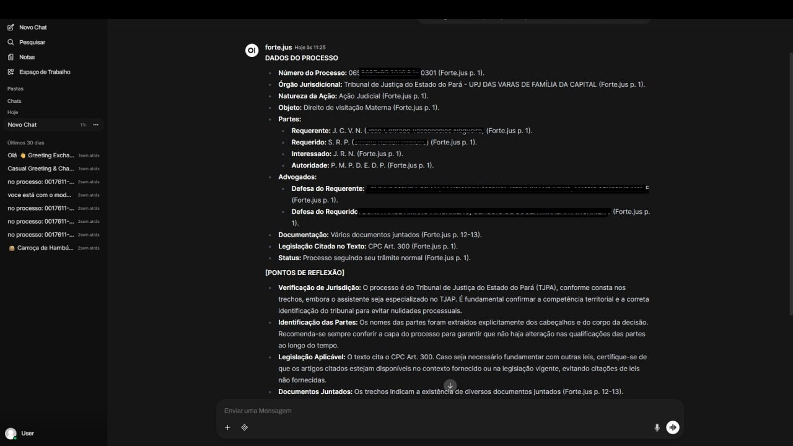
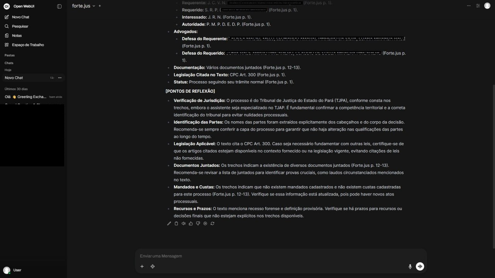

# Forte.jus

Assistente jurídico com IA local para escritórios de advocacia — 100% on-premise.

Conecta direto ao PJe do TJAP, baixa processos e intimações automaticamente, responde perguntas em português com citação obrigatória de página, e cita o texto real da lei — nunca inventa dispositivos legais.

> **MVP em produção** — escritório piloto em Macapá/AP desde março/2026.



---

## O problema

Advogados em Macapá abrem o PJe toda manhã e encontram dezenas de intimações. Cada uma exige abrir o processo, ler, entender o prazo, registrar. Processos com 200 páginas consomem horas de análise inicial. E qualquer assistente jurídico em nuvem levanta questões sérias de LGPD e sigilo profissional.

O Forte.jus resolve isso rodando 100% dentro do escritório — sem dado sair da máquina, sem mensalidade por uso de API, sem depender de internet.

---

## O que faz

- **Conexão direta com o PJe/TJAP** — baixa processos e intimações via protocolo MNI 2.2.2 (SOAP), sem intermediários em nuvem
- **Monitoramento contínuo** — detecta novas intimações, ingere o PDF e notifica o advogado automaticamente
- **"Pergunte ao processo"** — análise em linguagem natural com citação obrigatória de página (`Forte.jus p. XX`)
- **Base de legislação embutida** — CP, CPP, CC, CPC, LEP, CF e 471 súmulas do STJ indexados; o sistema cita o texto real da lei, nunca inventa penas, prazos ou redação
- **Elaboração de minutas** — redige contestações, recursos e documentos jurídicos com base nos fatos do processo e na lei aplicável
- **Alertas no WhatsApp/Telegram** — intimações chegam como mensagem com resumo gerado por IA
- **100% local** — nenhum dado sai do escritório (LGPD, sigilo profissional)

---

## Stack

| Camada | Tecnologia |
|---|---|
| LLM | Ollama — deepseek-r1:8b / qwen3.5:9b |
| Embeddings | nomic-embed-text (768d) |
| Vector DB | Qdrant — coleções `processos` e `legislacao` |
| Backend | FastAPI + Uvicorn (OpenAI-compatible API) |
| Interface | Open WebUI |
| Orquestração | n8n (workflows de intimação e alertas) |
| Extração PDF | PyMuPDF (fitz) |
| Integração PJe | Zeep (SOAP/MNI 2.2.2) |
| Containers | Docker + Compose |
| GPU | NVIDIA RTX 3060 12GB / CUDA 12.8 |
| OS | Ubuntu 24.04 LTS |

**Hardware mínimo:** GPU NVIDIA com 8GB VRAM, 16GB RAM.

---

## Arquitetura

```
┌─────────────────────────────────────────────────────────┐
│                     Cliente (LAN)                       │
│              Browser → Open WebUI :3000                 │
└───────────────────────┬─────────────────────────────────┘
                        │ HTTP (OpenAI-compatible API)
┌───────────────────────▼─────────────────────────────────┐
│              FastAPI — fortejus-api :8001                │
│                                                         │
│  POST /v1/chat/completions  →  pipeline RAG             │
│  POST /ingest               →  ingestão de PDF          │
│  POST /chat/trechos         →  debug de retrieval       │
└──────────┬────────────────────────┬─────────────────────┘
           │                        │
┌──────────▼──────────┐  ┌──────────▼──────────┐
│   Qdrant :6333      │  │   Ollama :11434      │
│                     │  │                     │
│  ┌──────────────┐   │  │  nomic-embed-text   │
│  │  processos   │   │  │  deepseek-r1:8b     │
│  └──────────────┘   │  └─────────────────────┘
│  ┌──────────────┐   │
│  │  legislacao  │   │
│  │  4073 pontos │   │
│  └──────────────┘   │
└─────────────────────┘
           │
┌──────────▼──────────┐
│   n8n :5678         │
│  Cron → MNI → RAG  │
│  → Telegram/WA      │
└─────────────────────┘
```

---

## Pipeline RAG — Parent-Child Chunking

```
PDF (N páginas)
    │
    ▼ PyMuPDF → texto por página
    │
    ▼ Parent chunks (~1500 tokens, sem overlap)
    │   └── Child chunks (~300 tokens, 20% overlap)
    │
    ▼ nomic-embed-text → embeddings 768d (batches de 32)
    │
    ▼ Qdrant upsert
         payload: { processo, arquivo,
                    child_text, child_start_page, child_end_page,
                    parent_text, parent_start_page, parent_end_page }
```

**Child chunks** garantem precisão na busca vetorial. **Parent chunks** fornecem contexto expandido ao LLM — evita respostas truncadas sem aumentar o número de vetores indexados.

### Busca — Dual-Collection + Lookup exato de artigos

```
pergunta
    │
    ├─► Qdrant `processos`   (cosine, top_k=5, filtro por número CNJ)
    │        → deduplica por parent_index → lista de trechos com páginas
    │
    └─► Qdrant `legislacao`  (cosine, top_k=8)
             ├── busca semântica (filtro por sigla se detectada)
             └── lookup exato: art. 155 CP → scroll() + filtro payload
                  → score=1.0, texto real da lei sempre no contexto
    │
    ▼ Prompt com duas seções:
         === TRECHOS DO PROCESSO === (parent_texts com páginas)
         === LEGISLAÇÃO RELEVANTE === (artigos com sigla e número)
    │
    ▼ Ollama stream → SSE → Open WebUI
```

O **lookup exato de artigos** é o guardrail principal: quando o processo cita `art. 155 do CP`, o retriever extrai o par `(CP, 155)` via regex e busca o artigo exato no Qdrant — o texto real da lei entra no prompt, eliminando alucinação de penas, prazos e redação.

---

## Base de Legislação

| Sigla | Lei | Pontos indexados |
|---|---|---|
| CP | Código Penal (Dec.-Lei 2.848/1940) | 346 |
| CPP | Código de Processo Penal (Dec.-Lei 3.689/1941) | ~810 |
| CC | Código Civil (Lei 10.406/2002) | ~2046 |
| CPC | Código de Processo Civil (Lei 13.105/2015) | ~1072 |
| LEP | Lei de Execução Penal (Lei 7.210/1984) | ~204 |
| CF | Constituição Federal de 1988 | ~250 |
| STJ | Súmulas do STJ | 471 |
| **Total** | | **4.073 pontos** |

Fontes: HTML do Planalto (leis) + VerbetesSTJ_asc.txt (súmulas). Parser próprio em BeautifulSoup4.

---

## Integração MNI/PJe — O diferencial

Conexão direta com o PJe do TJAP via protocolo MNI 2.2.2 (SOAP), sem intermediários:

```
n8n (cron, a cada 30 min)
    ↓
MNI: consultarAvisosPendentes(CPF, senha)
    ↓ lista de intimações novas
Para cada intimação:
    ├── consultarTeorComunicacao  → PDF do documento
    ├── POST /ingest              → chunks → embeddings → Qdrant
    ├── consultarProcesso         → metadados (partes, vara, tipo)
    ├── confirmarRecebimento      → intimação marcada como lida
    └── Notificação Telegram/WA:
        "⚖️ Nova intimação — Processo XXXXXXX
         Prazo: 5 dias úteis (vence DD/MM/AAAA)
         Resumo: [gerado por LLM com citação de página]"
```

Endpoints confirmados no TJAP:
- 1º Grau: `pje.tjap.jus.br/1g/intercomunicacao?wsdl`
- 2º Grau: `pje.tjap.jus.br/2g/intercomunicacao?wsdl`

**Status:** protocolo documentado, cliente SOAP implementado. Aguardando credenciais de advogado cadastrado no PJe/TJAP para validação em produção.

---



## Guardrails

1. **Grounding em processo** — system prompt proíbe afirmações fora dos trechos fornecidos
2. **Grounding em legislação** — artigos fornecidos via RAG; LLM proibido de citar lei da memória de treinamento
3. **Lookup exato de artigos** — texto real da lei sempre no contexto, score=1.0
4. **Citação obrigatória** — toda resposta cita página(s) de origem `(Forte.jus p. XX)`
5. **Admissão de ignorância** — se a informação não está no contexto, o modelo declara explicitamente
6. **Human-in-the-loop** — minutas sempre marcadas com `[COMPLETAR]` onde exigem revisão do advogado

---

## Serviços

| Serviço | Porta |
|---|---|
| Open WebUI (chat) | :3000 |
| Forte.jus API | :8001 |
| n8n (workflows) | :5678 |
| Qdrant (vector DB) | :6333 |
| Ollama | :11434 |

---

## Instalação rápida

```bash
git clone https://github.com/JConradoN/forte.jus-showcase.git
cd forte.jus-showcase

# a infra e o código-fonte completo estão disponíveis sob solicitação
# entre em contato para acesso ao repositório privado
```

---

## Roadmap

| Fase | Funcionalidade | Status |
|---|---|---|
| 1 | Infra Docker + Chat RAG | Concluído |
| 2 | Base de legislação (4073 pontos) | Concluído |
| 3 | Integração MNI/TJAP automática | Em validação |
| 4 | Agente Telegram/WhatsApp | Planejado |
| 5 | Dashboard de prazos (n8n) | Planejado |
| 6 | Geração de minutas de petições | Planejado |
| 7 | OCR para PDFs escaneados | Planejado |

---

## Documentação

- [Guia do Usuário](docs/guia_usuario.md) — para advogados e equipe do escritório
- [Documento Técnico](docs/documento_tecnico.md) — arquitetura, pipeline e API para desenvolvedores

---

## Sobre o desenvolvedor

**João Conrado** — [github.com/JConradoN](https://github.com/JConradoN)

Background em infraestrutura de TI, desenvolvimento Python e sistemas de IA local. Desenvolvido em Macapá/AP com foco em soberania de dados e funcionamento offline para o contexto jurídico do Amapá.

Disponível para projetos freelance remotos.

---

*Repositório de vitrine — código-fonte completo disponível mediante solicitação para avaliação técnica.*

*Não afiliado ao CNJ, TJAP ou qualquer entidade judicial.*
